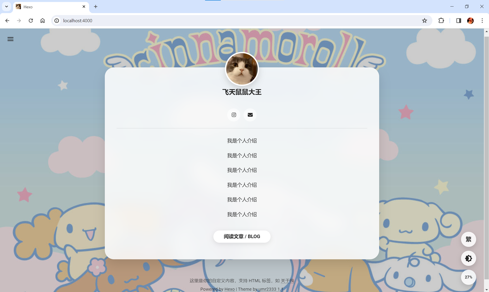
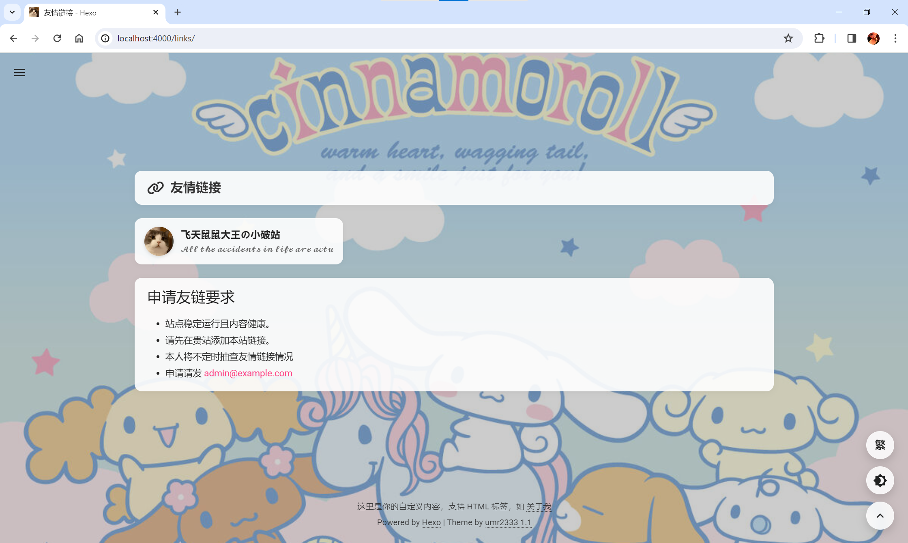

# hexo-theme-umr2333

## 自用hexo主题

因为突发奇想想搞一个简单的网页介绍
但是没有合适的主题
在现有的主题下修改一直出错

~~所以跟Gemini畅聊了一晚上~~

灵感来源：

[Butterfly](https://github.com/jerryc127/hexo-theme-butterfly) 、 [Kuri](https://github.com/kuricl/hexo-theme-kuri)


主题特性：

首页单页个人简介

可隐藏的博客文章入口

自定义友情链接页面


食用方法：

1.在你的Hexo根目录执行：

```bash
git clone -b master https://github.com/umr23333333/hexo-theme-umr2333.git themes/umr2333
```

或手动下载解压到Hexo\themes目录，文件夹命名为umr2333


2.（可选）修改Hexo根目录下_config.yml 选项 theme: umr2333

在 hexo 的根目录创建一个文件 _config.umr2333.yml，并把**主题目录的 _config.yml** 内容复制到 _config.umr2333.yml

注意不要删除根目录下的 _config.yml以及主题目录下的 _config.yml文件

如果不做这步配置请修改Hexo\themes\umr2333\\_config.yml中的内容，做了的话可以直接修改根目录下 _config.umr2333.yml中的内容


3.修改Hexo根目录下_config.yml中的theme

theme: umr2333


4.修改Hexo根目录下_config.yml中的title、subtitle、author等内容


#个人介绍页面生成

在你的hexo根目录执行：

hexo new page about 生成，请自行修改source\about\index.md中的内容


#友情链接页面生成

1.在你的hexo根目录执行：

hexo new page links

修改source\links\index.md

在title: links下方另起一行：

layout: links

title内容可修改，如 title: 友情链接

下方可写申请友链相关要求


2.新建文件：(如无文件夹请自行创建)

source\\_data\links.yml

links.yml文件模板：

```bash
link_list:
    - name: 飞天鼠鼠大王の小破站
      link: https://www.umr2333.com/
      avatar: https://www.umr2333.com/img/avatar.jpg
      descr: 𝓐𝓵𝓵 𝓽𝓱𝓮 𝓪𝓬𝓬𝓲𝓭𝓮𝓷𝓽𝓼 𝓲𝓷 𝓵𝓲𝓯𝓮 𝓪𝓻𝓮 𝓪𝓬𝓽𝓾𝓪𝓵𝓵𝔂 𝓹𝓻𝓮𝓭𝓮𝓼𝓽𝓲𝓷𝓮𝓭.
```

演示站点（可能使用最新测试中版本）：

[umr2333.com](https://www.umr2333.com)




*素材所用背景、头像、图标等内容来源于互联网，版权归原作者所有
